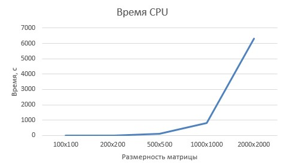
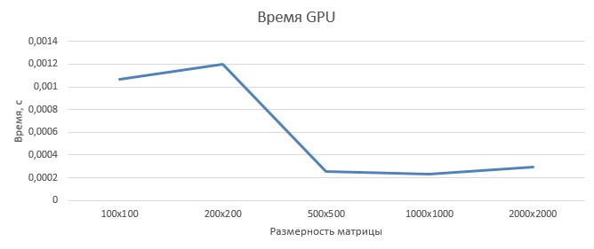
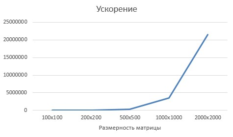

| Размерность   | GPU                             | CPU               | Ускорение             |
|:-------------:|:---------------:                |:-------------:    |:-------------:        |
| 100x100       | 0,001065406                     | 1,293599925       | 1214,184944           |
| 200x200       | 0,00119682600006854             | 5,469784855       | 4570,242337           |
| 500x500       | 0,000257065                     | 100,1194857       | 389471,479            |
| 1000x1000     | 0,00023227300016515             | 812,386203140999  | 3497549,016           |
| 2000x2000     | 0,000293928                     | 6325,471939096    | 21520481,01           |

Вывод: GPU даёт невероятное ускорение и его время не изменяется на данных размерностях матрицы
