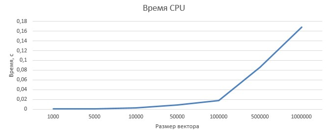
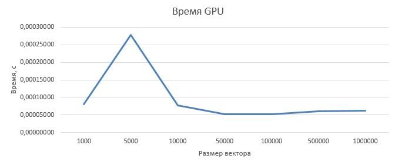
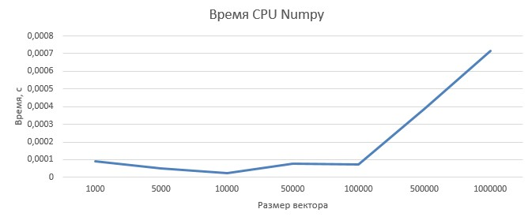
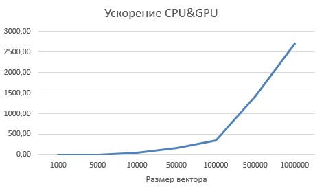
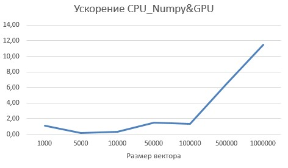

| Размер	| CPU	     | GPU	      |  CPU_np	   | Ускорение CPU&GPU |Ускорение CPU_Numpy&GPU |
|:---------:|:----------:|:----------:|:----------:|:-----------------:|:-------------------:   |  
| 1000	    | 0,00026094 | 0,00008102 |	0,00009101 | 3,22075069	       |1,12335378              |
| 5000	    | 0,00085448 | 0,00027746 |	0,00005265 | 3,07964334	       |0,18977373              |
| 10000	    | 0,00885073 | 0,00007725 |	0,00002505 | 39,19399643       |0,03699940              |
| 50000	    | 0,00885073 | 0,00005167 |	0,00007698 | 171,30671974	   |1,49003213              |
| 100000	| 0,01809322 | 0,00005289 |	0,00007249 | 342,07853749	   |1,37058535              |
| 500000	| 0,08633238 | 0,00006037 |	0,00039103 | 1430,03059643	   |6,47706682              |
| 1000000	| 0,16868689 | 0,00006213 |	0,00071566 | 2715,01975139	   |11,51851734             |

Вывод: Значительное ускорение на GPU можно получить только при больших размерностях вектора (более 500000), в иных случаях рациональнее использовать Numpy
